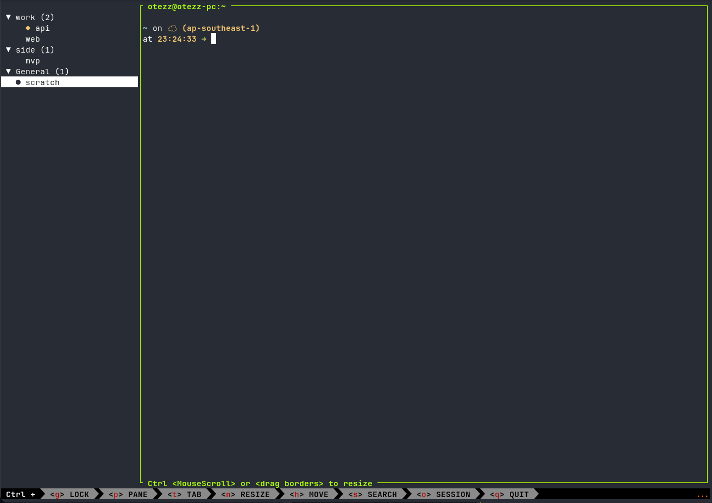

# zellij-vtabs

A vertical, grouped, collapsible tab sidebar for [Zellij](https://zellij.dev) — with attention indicators driven by Claude Code.

> ⚠️ **This is a personal tool, built for my own setup — not a general-purpose plugin.**
> It hardcodes assumptions about *my* workflow: my plugin path, my `:`-based tab-naming
> convention, my Zellij version, my Claude Code hooks. It is published for my own reuse
> across machines, not as something meant to work out-of-the-box for anyone else. There
> are no stability guarantees, no issue tracker, and no intention to generalize it. If you
> stumbled on this: feel free to read/fork, but expect to change paths and conventions to
> fit your own environment.

## What it does

Zellij has no native vertical tabs. This plugin renders a left sidebar showing tabs as a
**collapsible tree grouped by name prefix**, so I can keep many tabs organized at a glance:



Groups (`▼`/`▶`) collapse and expand; `◆` (yellow) marks a tab needing input, `✓` (green) a
finished one, and `●` marks the active tab.

- **Grouping** — a tab named `group:label` goes under group **group** with label **label**;
  a tab with no `:` lands in **General**. (First `:` wins.)
- **Collapse / expand** groups (`▶`/`▼`).
- **Reorder groups and tabs** — `Shift+J`/`Shift+K` (or `Shift+↓`/`Shift+↑`) move the
  selected row: a group header moves the whole group, a tab moves within its group. Tab
  moves are *virtual* (display-order only — the plugin API can't move real tabs): a group
  follows Zellij's native tab positions until you explicitly reorder in it, after which the
  saved order wins for that group.
- **Persistent state** — group order, tab order, and collapse state survive session
  restarts and stay in sync across every tab's sidebar (stored per session in the plugin's
  cache dir).
- **Rename inline** — `r` opens an inline editor (`Enter` commits, `Esc` cancels): on a
  group header it renames the group (every member tab is re-prefixed, saved state
  follows); on a tab row it renames the tab's label, keeping its group.
- **Auto-grouping (opt-in)** — a small shell script pipes each pane's starting directory
  (+ git facts) to the plugin, which auto-names still-default tabs (`repo:branch`,
  `repo:worktree`, …) by configurable rules. Manual names always win. See below.
- **Navigate** with `j`/`k`/arrows, `Enter`/`Space` to switch tab or toggle a group.
- **Mouse**: left-click to switch/toggle, scroll to move the selection.
- **Active tab** marked with `●`; the selection highlight follows it.
- **Attention icons** — `◆` (yellow, needs input) and `✓` (green, done), appearing on the
  tab and **rolling up to a collapsed group's header**. Cleared automatically when I focus
  the tab. Wired to Claude Code's `Notification`/`Stop` hooks.
- **Working spinner** — an animated cyan spinner while Claude is running in a tab (wired
  to the `UserPromptSubmit` hook). Unlike the attention icons it shows on the active tab
  too and is *not* cleared by focusing — it ends when Claude needs input, finishes, or
  exits (`SessionEnd`). Rolls up to collapsed group headers (waiting > working > done).

## Requirements

- **Zellij ≥ the `zellij-tile` version the wasm was built with** — release builds use
  `0.44.2`, and the prebuilt wasm is verified working on Zellij **0.43.1, 0.44.2, and
  0.44.3** (the protobuf plugin API tolerates version skew in both directions better than
  Zellij's error messages suggest; a plugin built against a *newer* `zellij-tile` than the
  running Zellij is the combination that reliably fails).
- **Building from source:** Rust + `cargo` with the `wasm32-wasip1` target
  (`rustup target add wasm32-wasip1`), and keep the `zellij-tile` pin **at or below** your
  Zellij version — don't use a caret/range requirement, Cargo resolves those upward.

## Quick try (zero install)

Zellij can load the plugin straight from the release URL — no download, no Rust. Save
this as `try-vtabs.kdl`:

```kdl
layout {
    pane split_direction="vertical" {
        pane size=28 borderless=true {
            plugin location="https://github.com/otezz/zellij-vtabs/releases/latest/download/zellij-vtabs.wasm"
        }
        pane
    }
    pane size=1 borderless=true {
        plugin location="zellij:status-bar"
    }
}
```

Pre-seed the permissions in `~/.cache/zellij/permissions.kdl` (the in-pane grant prompt
doesn't render usably in a 28-column sidebar):

```kdl
"https://github.com/otezz/zellij-vtabs/releases/latest/download/zellij-vtabs.wasm" {
    ReadApplicationState
    ChangeApplicationState
    ReadCliPipes
}
```

Then: `zellij --new-session-with-layout ./try-vtabs.kdl`. Zellij caches the download, so
this also survives offline use. Name a couple of tabs `group:label` and you have the tree.

## Build & install

```bash
cargo build --release --target wasm32-wasip1
cp target/wasm32-wasip1/release/zellij-vtabs.wasm ~/.config/zellij/plugins/zellij-vtabs.wasm
```

Or skip the Rust toolchain and grab the prebuilt `zellij-vtabs.wasm` from the
[latest release](https://github.com/otezz/zellij-vtabs/releases/latest):

```bash
curl -Lo ~/.config/zellij/plugins/zellij-vtabs.wasm \
  https://github.com/otezz/zellij-vtabs/releases/latest/download/zellij-vtabs.wasm
```

Pre-seed the plugin's permissions (Zellij's in-pane grant prompt doesn't render usably in a
narrow sidebar), in `~/.cache/zellij/permissions.kdl`. Note Zellij keys this by the **resolved
absolute** path, so use your real home dir here (not `~`):

```kdl
"/home/<you>/.config/zellij/plugins/zellij-vtabs.wasm" {
    ReadApplicationState
    ChangeApplicationState
    ReadCliPipes
}
```

Use the layout in `layouts/vtabs.kdl` (also copied to `~/.config/zellij/layouts/vtabs.kdl`),
and set it as the default in `~/.config/zellij/config.kdl`:

```kdl
default_layout "vtabs"
```

Fast dev loop (code-only changes — layout/config changes still need a fresh session):

```bash
cargo build --release --target wasm32-wasip1 \
  && cp target/wasm32-wasip1/release/zellij-vtabs.wasm ~/.config/zellij/plugins/zellij-vtabs.wasm
zellij action start-or-reload-plugin file:~/.config/zellij/plugins/zellij-vtabs.wasm
```

## Claude Code integration

The attention icons and working spinner are driven by Claude Code hooks. Rather than each
hook piping a fixed signal, they call `shell/vtabs-work.sh` with an event name; the script
keeps a per-pane count of the main-agent turn plus outstanding subagents and derives the
right signal — so the spinner stays lit for the *whole* task, not just the main agent's
first turn. Install it and wire the hooks:

```bash
cp shell/vtabs-work.sh ~/.config/zellij/vtabs-work.sh && chmod +x ~/.config/zellij/vtabs-work.sh
```

```json
{
  "hooks": {
    "UserPromptSubmit": [{ "hooks": [{ "type": "command", "timeout": 3,
      "command": "(~/.config/zellij/vtabs-work.sh prompt >/dev/null 2>&1 &)" }] }],
    "SubagentStart": [{ "hooks": [{ "type": "command", "timeout": 3,
      "command": "(~/.config/zellij/vtabs-work.sh subagent-start >/dev/null 2>&1 &)" }] }],
    "SubagentStop": [{ "hooks": [{ "type": "command", "timeout": 3,
      "command": "(~/.config/zellij/vtabs-work.sh subagent-stop >/dev/null 2>&1 &)" }] }],
    "Notification": [{ "hooks": [{ "type": "command", "timeout": 3,
      "command": "(~/.config/zellij/vtabs-work.sh notify >/dev/null 2>&1 &)" }] }],
    "Stop": [{ "hooks": [{ "type": "command", "timeout": 3,
      "command": "(~/.config/zellij/vtabs-work.sh stop >/dev/null 2>&1 &)" }] }],
    "SessionEnd": [{ "hooks": [{ "type": "command", "timeout": 3,
      "command": "(~/.config/zellij/vtabs-work.sh end >/dev/null 2>&1 &)" }] }]
  }
}
```

- `UserPromptSubmit` (new turn) → start fresh, animated spinner on that tab
- `SubagentStart` / `SubagentStop` → adjust the outstanding-subagent count (spinner stays lit)
- `Notification` (needs input) → `◆` on that tab
- `Stop` (main-agent turn ended) → `✓` **only if no subagents are still outstanding**,
  otherwise the spinner keeps running — this is the whole reason for the counter: `Stop`
  fires once per *main-agent* turn, so without it the spinner would clear while background
  subagents are still working
- `SessionEnd` (Claude exits) → clears any leftover spinner and the pane's count
- Focusing the tab clears `◆`/`✓`; the spinner survives focus and ends via the hooks above

The script also plays a freedesktop sound on exactly those two real events — `complete`
when the whole task finishes and `message-new-instant` when it needs input — gated by the
same counter, so you get one chime per task rather than one per main-agent turn or subagent.
It falls back `canberra-gtk-play` → `pw-play` → silent, so it's a no-op where neither exists.
Delete the `sound=` / playback lines in `vtabs-work.sh` to turn it off.

Why the script (rather than a fixed pipe per hook, and why a shell counter rather than one
in the plugin): the plugin runs one instance per tab and pipe delivery across instances
isn't reliable, so a counter in plugin memory would diverge — the shell gives one per-pane
state file guarded by `flock`. Inside the script every `zellij pipe` still uses
`< /dev/null` (without it the pipe reads Claude's hook stdin until EOF and deadlocks) and
`timeout 3` (which actually kills the pipe when no plugin is listening — a session without
this layout — since the hook-level `"timeout"` only stops Claude *waiting*). The `( … & )`
subshell makes each hook return instantly. (Shell backgrounding is fine; Claude Code's
`async: true` hook property is not — async hooks failed to deliver pipes reliably in testing.)

Manual test — note it must target a **non-active** tab (the plugin never marks the tab you're
currently on, by design):

```bash
# on tab B:
echo $ZELLIJ_PANE_ID        # e.g. 3
# switch to another tab, then:
zellij pipe --name "zellij-vtabs::waiting::3"
```

## Auto-grouping (opt-in)

The plugin can name default-named (`Tab #N`) tabs from each pane's starting directory.
Plugins can't see pane cwds (WASI sandbox), so a small script pipes the facts in:

```bash
cp shell/vtabs-rename.sh ~/.config/zellij/vtabs-rename.sh
chmod +x ~/.config/zellij/vtabs-rename.sh
```

Run it once per shell start — e.g. in `~/.zshrc`:

```zsh
(~/.config/zellij/vtabs-rename.sh &) 2>/dev/null
```

Then enable it in the layout's `plugin` block:

```kdl
autogroup_default "repo"                      // repo | dir | off (default: off)
autogroup_1 "/mnt/d/codes/work/** -> work"    // optional cwd-glob overrides, tried in order
```

- `repo` — group = the owning git repo's name, worktree-aware: a pane in a linked worktree
  gets `repo:worktree-dir`; at the repo root the label is the branch; in a subdir, the dir
  name. Non-repo dirs are left alone.
- `dir` — plain `basename $cwd` (lands in **General**) when no rule matches.
- Only tabs still named `Tab #N` are renamed — name a tab manually and it stays yours.

### Claude Code worktrees

To have `claude -w CH-123` label its tab with the worktree name (`repo:CH-123`), add a
`SessionStart` hook — `force` mode deliberately overrides the tab's current name:

```json
"SessionStart": [{ "hooks": [{ "type": "command", "timeout": 5,
  "command": "(~/.config/zellij/vtabs-rename.sh force >/dev/null 2>&1 &)" }] }]
```

### Worktree launcher

`claude -w` names the worktree for you. To create one with **your own name**, in a new tab
grouped under the repo and already running Claude, use the `nw` / `rw` shell functions:

```bash
cp shell/vtabs-worktree.zsh ~/.config/zellij/vtabs-worktree.zsh
cp layouts/vtabs-claude.kdl ~/.config/zellij/layouts/vtabs-claude.kdl   # a vtabs layout whose main pane runs `claude`
# in ~/.zshrc:
source ~/.config/zellij/vtabs-worktree.zsh
```

- `nw ch-322` → worktree at `<repo>/.claude/worktrees/ch-322` on a new branch `ch-322`,
  opened in a new tab named `<repo>:ch-322` (so it lands in the repo's group) running Claude.
  `nw ch-322 main` branches off `main`. Run it from anywhere inside the repo.
- `rw` (from inside a worktree tab) removes that worktree and closes the tab; `rw -f` forces
  past uncommitted changes. It refuses to touch the main worktree.

## Configuration

Optional plugin config in the layout's `plugin` block (defaults shown):

```kdl
plugin location="file:~/.config/zellij/plugins/zellij-vtabs.wasm" {
    separator ":"          // tab-name group separator
    waiting_icon "◆"       // rendered yellow
    completed_icon "✓"     // rendered green
    spinner "⣾⣽⣻⢿⡿⣟⣯⣷"    // working animation: each char = one frame
    // plus the autogroup_* keys described above
}
```

### Spinner


Compare animation candidates on the **[live preview page](https://otezz.github.io/zellij-vtabs/spinner.html)**
(every set spinning inside a mock sidebar row), copy the frames you like, and set them via
the `spinner` config key. Width-1 glyphs only — emoji frames are double-width and break
the sidebar's column math.

## Architecture notes (why it's built this way)

The one non-obvious design decision, learned the hard way:

**Zellij spawns one plugin instance per tab, and per-instance mutable state always diverges** —
broadcast CLI pipes and `pipe_message_to_plugin` don't reliably fan out to every instance, and
`Event::Visible` / `PaneUpdate.is_focused` aren't usable signals here (`is_focused` came through
as `None`). The *only* state every instance reads identically is the **tab name** (via
`TabUpdate`). So attention is encoded as a name suffix (` ⏳`/` ✅`) applied with `rename_tab`
(a global mutation), then parsed back out for display.

The working model, which avoids any set/clear race:

- **Set** marks a tab *only if it isn't the active tab* (you don't need a cue for what you're
  looking at).
- **Clear** strips the marker from the active tab on every `TabUpdate` (switching to a tab makes
  it active → it's "seen" → cleared).

Group order and collapse state follow the same "only global state survives" rule: they live
in a small file under the plugin's `/cache` mount (host side:
`~/.cache/zellij/<plugin-location>/plugin_cache/`), which Zellij keys by plugin *location* —
so every per-tab instance reads the same file. One file **per session** (named from
`ModeUpdate`'s `session_name`), because a single shared file would let each session's save
wipe the others' groups. Instances re-read the file on every `TabUpdate`, and only the
focused (visible) instance ever writes, so the sidebar you're looking at is always fresh.

Two build gotchas on modern Rust + Zellij:

1. **Pin `zellij-tile` exactly, at or below the oldest Zellij you target** (`= 0.44.2`). A
   caret range grabs the newest patch, and a plugin built against a newer `zellij-tile`
   than the running Zellij fails to load (`could not find exported function`). The reverse
   direction is fine — an older-tile build runs on newer Zellij.
2. **Build as a binary crate, not `cdylib`.** On current Rust, a `cdylib` for `wasm32-wasip1`
   emits a WASI *reactor* (no `_start`); Zellij needs a *command* (`_start`). A bin crate lets
   `register_plugin!`'s own `main` become `_start`. (Don't add your own `fn main` — the macro
   defines one.)

## Layout / status bar

`layouts/vtabs.kdl` puts the 28-col sidebar left of the main pane, with Zellij's single-line
`status-bar` (`size=1`) at the bottom to keep the key hints — matching the default layout's look.
